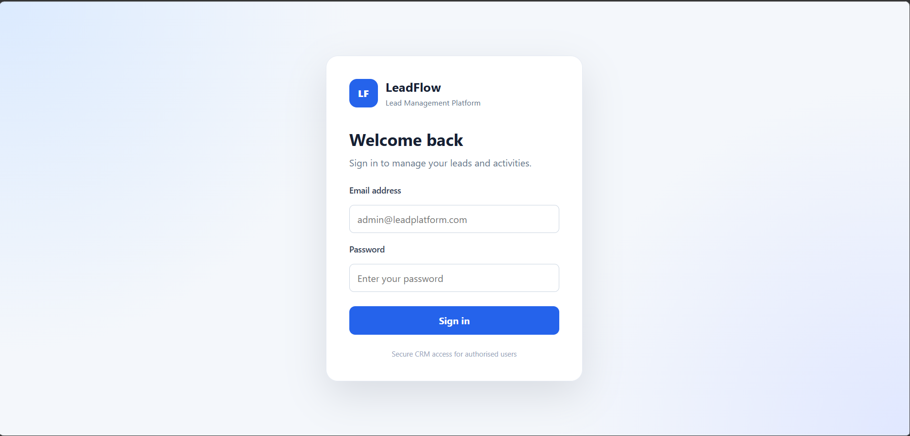
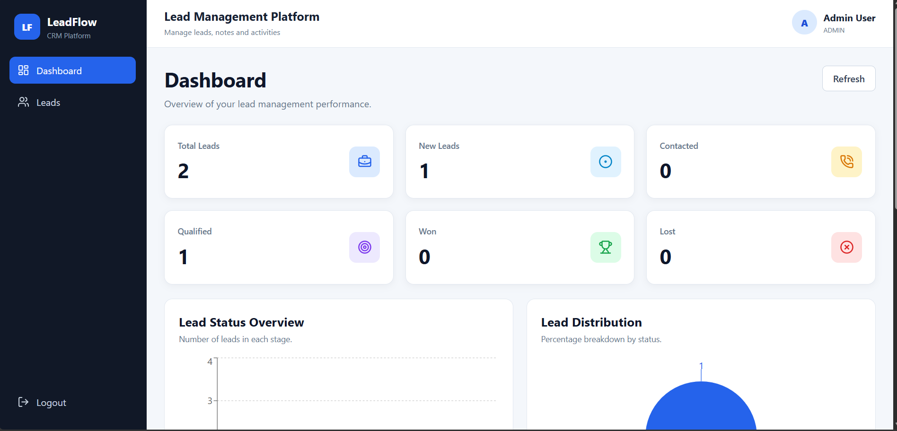
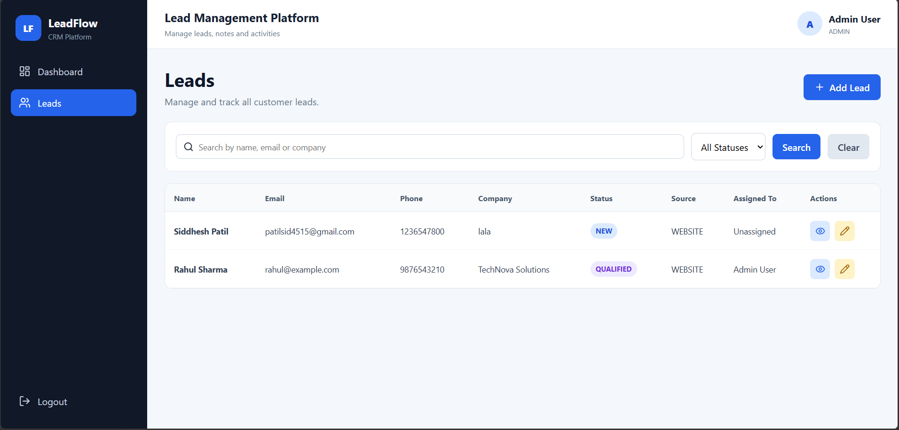
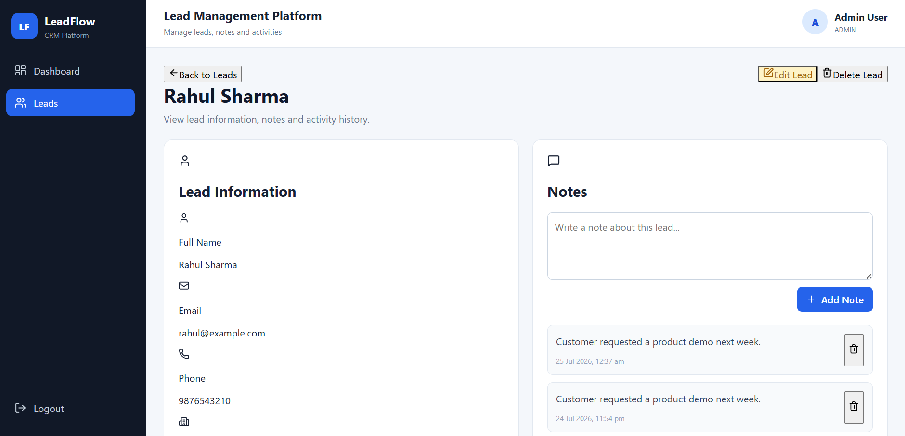

# Lead Management Platform

A full-stack Lead Management Platform built using **Spring Boot**, **React**, **MySQL**, and **JWT Authentication**. The application enables sales teams to efficiently manage leads, track customer interactions, and monitor sales performance through an interactive dashboard.

---
# Lead Management Platform

(Short project description)

## Screenshots

### Login Page


### Dashboard


### Leads


### Lead Details


---

## Features
...

## Features

### Authentication
- User Registration
- Secure Login with JWT Authentication
- Protected Routes
- Role-Based Authentication Ready

### Dashboard
- Total Leads Overview
- Lead Status Statistics
- Conversion Rate
- Interactive Charts
- Recent Leads Table

### Lead Management
- Create Lead
- View Lead Details
- Edit Lead
- Delete Lead
- Search Leads
- Pagination
- Sorting
- Status Filtering

### Notes & Activity
- Add Notes to Leads
- Delete Notes
- Automatic Activity Tracking
- Complete Lead Timeline

### User Interface
- Responsive Design
- Modern Dashboard
- Toast Notifications
- Clean Navigation
- Mobile Friendly

---

## Tech Stack

### Frontend
- React
- React Router
- Axios
- Recharts
- Lucide React
- CSS

### Backend
- Spring Boot
- Spring Security
- JWT Authentication
- Spring Data JPA
- Hibernate
- Maven

### Database
- MySQL

---

## Project Structure

```
lead-management-platform
│
├── backend
│   ├── src
│   ├── pom.xml
│   └── ...
│
├── frontend
│   ├── src
│   ├── package.json
│   └── ...
│
└── README.md
```

---

## Installation

### Clone Repository

```bash
git clone https://github.com/Siddhu3322/lead-management-platform.git
```

### Backend

```bash
cd backend
```

Configure your database in:

```
application.properties
```

Run:

```bash
./mvnw spring-boot:run
```

Backend runs on:

```
http://localhost:8080
```

---

### Frontend

```bash
cd frontend
npm install
npm run dev
```

Frontend runs on:

```
http://localhost:5173
```

---

## API Highlights

### Authentication

- POST `/api/auth/register`
- POST `/api/auth/login`

### Leads

- GET `/api/leads`
- POST `/api/leads`
- PUT `/api/leads/{id}`
- DELETE `/api/leads/{id}`

### Notes

- POST `/api/leads/{id}/notes`
- GET `/api/leads/{id}/notes`
- DELETE `/api/leads/{id}/notes/{noteId}`

### Activities

- GET `/api/leads/{id}/activities`

### Dashboard

- GET `/api/dashboard/summary`

---

## Future Improvements

- Excel Export
- Email Notifications
- Role-Based Authorization
- Dark Mode
- Docker Support
- Cloud Deployment

---

## Author

**Siddhesh Changa Patil**

GitHub:
https://github.com/Siddhu3322

---

## License

This project is licensed under the MIT License.